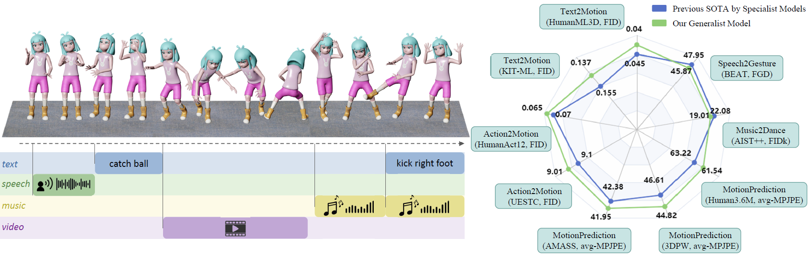

<h1>Large Motion Model for Unified Multi-Modal Motion Generation</h1>

    <a href='https://mingyuan-zhang.github.io/' target='_blank'>Mingyuan Zhang</a>1*&emsp;
    <a href='' target='_blank'>Daisheng Jin</a>1*&emsp;
    <a href='https://www.linkedin.com/in/rheallyc/' target='_blank'>Chenyang Gu</a>1*&emsp;
    <a href='https://hongfz16.github.io/' target='_blank'>Fangzhou Hong</a>1&emsp;
    <a href='https://caizhongang.github.io/' target='_blank'>Zhongang Cai</a>1,2&emsp;
    <a href='https://www.linkedin.com/in/jingfang-h-26746013a/' target='_blank'>Jingfang Huang</a>1&emsp;
    <a href='https://scholar.google.com/citations?user=MaAiOikAAAAJ&hl=en' target='_blank'>Chongzhi Zhang</a>1&emsp;
    <a href='https://gxyes.github.io/' target='_blank'>Xinying Guo</a>1&emsp;
    <a href='https://yanglei.me/' target='_blank'>Lei Yang</a>2&emsp;
    <a href='https://personal.ntu.edu.sg/yhe/' target='_blank'>Ying He</a>1&emsp;
    <a href='https://liuziwei7.github.io/' target='_blank'>Ziwei Liu</a>1+

    1S-Lab, Nanyang Technological University&emsp;
    2SenseTime Research&emsp;

    *co-first authors
    +corresponding author

---

<h4 align="center">
  <a href="https://mingyuan-zhang.github.io/projects/LMM.html" target='_blank'>[Project Page]</a> •
  <a href="https://arxiv.org/pdf/2404.01284.pdf" target='_blank'>[PDF]</a> •
  <a href="https://arxiv.org/abs/2404.01284" target='_blank'>[arXiv]</a> •
  <a href="https://www.youtube.com/watch?v=Aprm9h8lFj4" target='_blank'>[Video]</a> •
  <a href="https://lmm.readthedocs.io/en/latest/index.html" target='_blank'>[Documentation]</a>
     
  
  
</h4>

<tr>
    
</tr>

>**Abstract:** Human motion generation, a cornerstone technique in animation and video production, has widespread applications in various tasks like text-to-motion and music-to-dance.
Previous works focus on developing specialist models tailored for each task without scalability.
In this work, we present <strong>Large Motion Model (LMM)</strong>, a motion-centric, multi-modal framework that unifies mainstream motion generation tasks into a generalist model.
A unified motion model is appealing since it can leverage a wide range of motion data to achieve broad generalization beyond a single task.
However, it is also challenging due to the heterogeneous nature of substantially different motion data and tasks.
LMM tackles these challenges from three principled aspects:
<strong>1)</strong> <i>Data:</i> We consolidate datasets with different modalities, formats and tasks into a comprehensive yet unified motion generation dataset,
    <strong>MotionVerse</strong>, comprising 10 tasks, 16 datasets, a total of 320k sequences, and 100 million frames.
<strong>2)</strong> <i>Architecture:</i> We design an articulated attention mechanism <strong>ArtAttention</strong> that incorporates body part-aware modeling into Diffusion Transformer backbone.
<strong>3)</strong> <i>Pre-Training:</i> We propose a novel pre-training strategy for LMM, which employs variable frame rates and masking forms, to better exploit knowledge from diverse training data.
Extensive experiments demonstrate that our generalist LMM achieves competitive performance across various standard motion generation tasks over state-of-the-art specialist models. Notably, LMM exhibits strong generalization capabilities and emerging properties across many unseen tasks.

Code is coming soon.