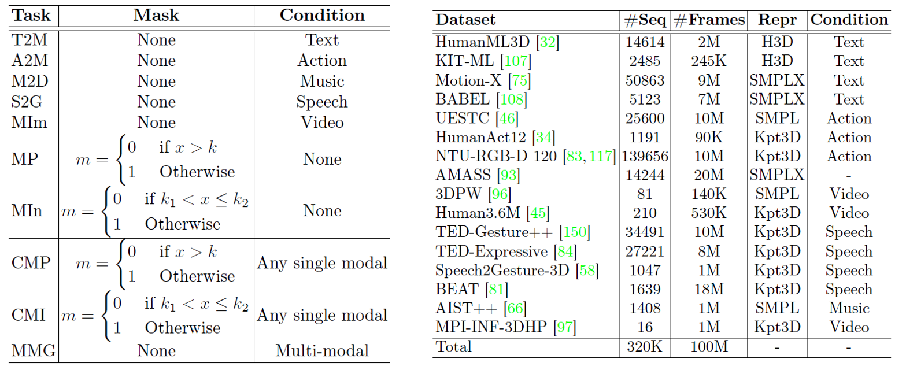

# MotionVerse

<!-- TOC -->

- [Introduction](#introduction)
- [Data Preprocessing](#data-preprocessing)
    - [AMASS](#amass)
    - [HumanML3D](#humanml3d)
    - [KIT-ML](#kit-ml)
    - [BABEL](#babel)
    - [Motion-X](#motion-x)
    - [HumanAct12](#humanact12)
    - [UESTC](#uestc)
    - [NTU-RGB-D 120](#ntu-rgb-d-120)
    - [3DPW](#dpw)
    - [Human3.6M](#human3-6m)
    - [TED-Gesture++](#ted-gesture)
    - [TED-Expressive](#ted-expressive)
    - [Speech2Gesture-3D](#speech2gesture-3d)
    - [BEAT](#beat)
    - [AIST++](#aist)
    - [MPI-INF-3DHP](#mpi-inf-3dhp)
- [Evaluation](#evaluation)
- [Citation](#citation)

<!-- TOC -->

## Introduction


Large models have been extensively studied in fields such as language, image, and video. These models, by absorbing common knowledge from vast amounts of data and leveraging a unified task format, demonstrate outstanding performance across multiple tasks. However, on the path towards large motion models, a significant challenge lies ahead: the inconsistent motion formats across datasets. Specifically, there are three types of inconsistencies:

- **Inconsistent pose representations**: For instance, the UESTC benchmark adopts a 6D rotation representation based on SMPL, while the Human3.6M motion prediction benchmark uses keypoint coordinates.
- **Inconsistent number of keypoints**: For example, TED-Gesture++ only includes upper body keypoints, while NTU-RGBD 120 lacks fine-grained keypoints for the hands.
- **Inconsistent frame rates**: KIT-ML operates at 12.5 fps, whereas Motion-X runs at 30 fps.

Such differences not only demand models capable of handling diverse data formats but also pose significant challenges in acquiring common knowledge. To address this challenge, we introduce the first unified and comprehensive motion-centric benchmark **MotionVerse**, the workflow of which is shown in Figure. MotionVerse possesses three advantages: 

- **Unified Problem Formulation**: we describe mainstream tasks within a unified framework, reducing the need to consider task-specific properties during model design.
- **Unified Motion Representation**: we convert the motion formats of various datasets into a unified intermediate representation, enabling the model to acquire common knowledge from the originally diverse data formats and to be evaluated on different datasets smoothly.
- **Systematicness and Comprehensiveness**: we encompass 10 tasks across 16 datasets, comprising 320K sequences and nearly 100M frames of motion data, as shown in Table below, which enables us to explore large motion models.



## Data Preprocessing

Due to licensing restrictions on most MoCap data, we cannot directly share our processed data.
Therefore, we provide documentation here to describe the processing methods for each dataset. 
For the data that can be provided, we will offer it in a processed format for [download](https://drive.google.com/drive/folders/1FBu7AtKRKesUu6q4CNa4aq451BpEvy1O?usp=drive_link).

The file structure should be:
```text
MoGen
├── mogen
├── docs
├── tools
├── configs
└── data
    ├── motion_verse
    │   ├── body_models
    │   │   ├── smpl_skeleton.npz
    │   │   └── prepare.sh 
    │   ├── raw_data
    │   │   ├── 3dpw
    │   │   ├── aist
    │   │   ├── amass
    │   │   ├── babel
    │   │   ├── ...
    │   │   └── uestc 
    │   ├── datasets
    │   │   ├── 3dpw
    │   │   ├── aist
    │   │   ├── amass
    │   │   ├── babel
    │   │   ├── ...
    │   │   └── uestc 
    │   ├── pretrained
    │   └── statistics
    └── datasets  // for other models
```

In our experiment, we will use the [SMPL](https://smpl.is.tue.mpg.de/), [SMPL+H](https://mano.is.tue.mpg.de/), and [SMPL-X](https://smpl-x.is.tue.mpg.de/) body models. Please download the following files: [smplh](https://mano.is.tue.mpg.de/) (choose the Extended SMPL+H model used in the AMASS project), [dmpls](https://smpl.is.tue.mpg.de/) (choose DMPLs compatible with SMPL), and [smplx](https://smpl-x.is.tue.mpg.de/) (choose the option for SOMA/MoSh/AMASS), to create the following file structure:
```text
motion_verse
    └── body_models
        ├── dmpls.tar.xz
        ├── smplh.tar.xz
        ├── smplx_locked_head.tar.bz2
        └── prepare.sh
```
Run `prepare.sh` and then the file structure will be:
```text
body_models/
├── dmpls
│   ├── female
│   │   └── model.npz
│   ├── LICENSE.txt
│   ├── male
│   │   └── model.npz
│   └── neutral
│       └── model.npz
├── dmpls.tar.xz
├── prepare.sh
├── smpl_skeleton.npz
├── smplh
│   ├── female
│   │   └── model.npz
│   ├── info.txt
│   ├── LICENSE.txt
│   ├── male
│   │   └── model.npz
│   └── neutral
│       └── model.npz
├── smplh.tar.xz
├── smplx
│   ├── female
│   │   ├── model.npz
│   │   └── model.pkl
│   ├── LICENSE.txt
│   ├── male
│   │   ├── model.npz
│   │   └── model.pkl
│   └── neutral
│       ├── model.npz
│       └── model.pkl
└── smplx_locked_head.tar.bz2
```

Download imagebind pretrained model from [link](https://drive.google.com/drive/folders/1FBu7AtKRKesUu6q4CNa4aq451BpEvy1O?usp=drive_link) and store it under folder `data/motionverse/imagebind_huge.pth`

### AMASS

The AMASS (Archive of Motion Capture as Surface Shapes) dataset is a large-scale collection of 3D human motion data. It aggregates numerous existing motion capture datasets, unifying them under the SMPL+H (Skinned Multi-Person Linear + Hand) body model and SMPL-X (SMPL eXpressive). AMASS provides high-quality, accurate 3D human poses in a variety of motion sequences, making it a valuable resource for research and applications in areas such as computer vision, animation, biomechanics, and machine learning. The dataset captures a wide range of motions, from everyday activities like walking and sitting to more complex actions like dancing and sports, ensuring diversity in motion types. AMASS simplifies access to motion data by converting the raw motion capture data into SMPL+H/SMPL-X body parameters. These parameters define the body pose, shape, and global orientation, allowing for easy use in various applications that require realistic human movement modeling. The AMASS dataset can be downloaded from the [official AMASS website](https://amass.is.tue.mpg.de/) after registration.

Here, we download and use the SMPL+H format of the AMASS dataset. Please organize the downloaded files according to the following file structure:
```text
motion_verse
    └── raw_data
        └── amass
            ├── create_dataset.py
            ├── prepare.sh
            ├── process_pose.py
            ├── sequence_name.txt
            └── amass_data
                ├── ACCAD.tar.bz2
                ├── BMLhandball.tar.bz2
                ├── BMLmovi.tar.bz2
                ├── BMLrub.tar.bz2
                ├── CMU.tar.bz2
                ├── DanceDB.tar.bz2
                ├── DFaust.tar.bz2
                ├── EKUT.tar.bz2
                ├── EyesJapanDataset.tar.bz2
                ├── GRAB.tar.bz2
                ├── HDM05.tar.bz2
                ├── HUMAN4D.tar.bz2
                ├── HumanEva.tar.bz2
                ├── KIT.tar.bz2
                ├── MoSh.tar.bz2
                ├── PosePrior.tar.bz2
                ├── SFU.tar.bz2
                ├── SOMA.tar.bz2
                ├── SSM.tar.bz2
                ├── TCDHands.tar.bz2
                ├── TotalCapture.tar.bz2
                └── Transitions.tar.bz2
```

The AMASS dataset will be used in multiple tasks. As a high-quality motion capture dataset, it will first be utilized for training in unconditional motion generation, helping the model learn motion priors. Additionally, the HumanML3D and BABEL text-to-motion datasets are both based on the AMASS data with added text annotations. Finally, the AMASS dataset will also be used in the motion prediction task. Here, we primarily focus on its support for the tasks of unconditional generation and motion prediction.

```shell
# Enter the folder `motion_verse/raw_data/amass`
sh prepare.sh
```

### HumanML3D

[HumanML3D](https://github.com/EricGuo5513/HumanML3D) is a large-scale dataset designed for text-to-motion generation tasks, where the goal is to generate realistic 3D human motion from natural language descriptions. The dataset is built on top of high-quality 3D motion data, primarily sourced from the AMASS dataset, and is enhanced with textual annotations. These annotations describe a wide variety of human actions and movements, providing a rich connection between language and motion. HumanML3D includes diverse motion sequences, ranging from simple actions like walking and sitting to more complex interactions such as dancing or playing sports. Each motion is paired with detailed textual descriptions, making it suitable for training models that require understanding the relationship between language and human movement. 

The HumanML3D dataset is primarily used to train the model's text-driven motion generation capabilities. Since HumanML3D uses AMASS data, please complete the preprocessing of the AMASS dataset before working with HumanML3D. All other required data has been placed in the HumanML3D folder. The overall directory structure is as follows:
```text
motion_verse
    └── raw_data
        └── humanml3d
            ├── create_dataset.py
            ├── index.csv
            ├── pose_data
            │   └── humanact12.zip
            ├── prepare.sh
            ├── process_eval_motion.py
            ├── process_official_segment.py
            ├── process_segment.py
            └── texts.zip
```
After enter the folder `motion_verse/raw_data/humanml3d`, run the following command to complete the creation of the HumanML3D dataset."
```shell
sh prepare.sh
```
If you have a GPU available, we strongly recommend running it on the GPU, as this will speed up the process by nearly 20 times. You can specify the desired GPU ID:
```shell
CUDA_VISIBLE_DEVICES=${GPU_ID} sh prepare.sh
```
You may download files for evaluation and dataset splits via [link](https://drive.google.com/drive/folders/1FBu7AtKRKesUu6q4CNa4aq451BpEvy1O?usp=drive_link) and unzip it as shown below:
```text
motion_verse
    └── datasets
        └── humanml3d
            ├── evaluators
            │   ├── finest.tar
            │   ├── glove
            │   │   ├── our_vab_data.npy
            │   │   ├── our_vab_idx.pkl
            │   │   └── our_vab_words.pkl
            │   ├── mean.npy
            │   └── std.npy
            ├── eval_motions
            │   ├── 000000.npy
            │   ├── ...
            │   └── M014615.npy
            ├── metas
            │   ├── 000000.json
            │   ├── ...
            │   └── M014615.json
            ├── motions
            │   ├── 000000.npz
            │   ├── ...
            │   └── M014615.npz
            ├── splits
            │   ├── official_test.txt
            │   ├── official_train.txt
            │   ├── official_train_val.txt
            │   ├── official_val.txt
            │   └── train.txt
            ├── text_feats
            │   ├── 000000.pkl
            │   ├── ...
            │   └── M014615.pkl
            └── texts
                ├── 000000.json
                ├── ...
                └── M014615.json
```

### KIT-ML

The [KIT-ML dataset](https://motion-annotation.humanoids.kit.edu/dataset/) is an open-source 3D human motion capture dataset designed for research in machine learning and computer vision. Developed by the Karlsruhe Institute of Technology (KIT), it provides a comprehensive collection of human motion data, making it suitable for various tasks such as motion generation, action recognition, and pose estimation.

Since the commonly used evaluation benchmark currently utilizes data processed from the original KIT-ML dataset by [Guo et al.](https://github.com/EricGuo5513/HumanML3D), we further post-process the data provided by Guo et al. to align it with the format of other motion datasets we are using. We have already processed the data. You may download via [link](https://drive.google.com/drive/folders/1FBu7AtKRKesUu6q4CNa4aq451BpEvy1O?usp=drive_link) and unzip it as shown below:
```text
motion_verse
    └── datasets
        └── kitml
            ├── evaluators
            │   ├── finest.tar
            │   ├── glove
            │   │   ├── our_vab_data.npy
            │   │   ├── our_vab_idx.pkl
            │   │   └── our_vab_words.pkl
            │   ├── mean.npy
            │   └── std.npy
            ├── eval_motions
            │   ├── 00001.npy
            │   ├── ...
            │   └── M03966.npy
            ├── metas
            │   ├── 00001.json
            │   ├── ...
            │   └── M03966.json
            ├── motions
            │   ├── 00001.npz
            │   ├── ...
            │   └── M03966.npz
            ├── splits
            │   ├── official_test.txt
            │   ├── official_train.txt
            │   ├── official_train_val.txt
            │   ├── official_val.txt
            │   └── train.txt
            ├── text_feats
            │   ├── 00001.pkl
            │   ├── ...
            │   └── M03966.pkl
            └── texts
                ├── 00001.json
                ├── ...
                └── M03966.json
```


### BABEL

The BABEL dataset is a large-scale resource that connects 3D human motion capture data with rich natural language descriptions. Developed to advance research at the intersection of computer vision, natural language processing, and computer graphics, BABEL adds detailed textual annotations to the motion sequences found in the AMASS dataset, enabling a deeper understanding of human actions and movements.

The BABEL dataset is primarily used to train the model's text-driven motion generation capabilities. Since BABEL uses AMASS data, please complete the preprocessing of the AMASS dataset before working with BABEL. Then download annotation from [BABEL website](https://babel.is.tue.mpg.de/index.html). All other required data has been placed in the BABEL folder. The overall directory structure is as follows:
```text
motion_verse
    └── raw_data
        └── babel
            ├── create_dataset.py
            ├── prepare.sh
            └── babel_v1-0_release.zip
```
After run `prepare.sh`, the created files are organized as:
```text
motion_verse
    └── datasets
        └── motionx
            ├── metas
            │   ├── 0.json
            │   ├── ...
            │   └── 9999.json
            ├── motions
            │   ├── 0.npz
            │   ├── ...
            │   └── 9999.npz
            ├── splits
            │   └── train.txt
            ├── text_feats
            │   ├── 0.pkl
            │   ├── ...
            │   └── 9999.pkl
            └── texts
                ├── 0.json
                ├── ...
                └── 9999.json
```

### Motion-X

The [Motion-X](https://motion-x-dataset.github.io/) dataset is a large-scale 3D human motion dataset. It is designed to advance research in motion generation, understanding, and related fields within computer vision, graphics, and machine learning. Motion-X offers an extensive collection of human motion capture data, encompassing a wide variety of actions, behaviors, and interactions. This includes everyday activities, sports movements, and complex dynamic sequences. Each motion sequence is paired with detailed natural language descriptions. This multimodal aspect enables research in text-to-motion generation, motion captioning, and enhances the alignment between language and physical movement. Motion-X is organized in a consistent and accessible format, facilitating easy integration with existing tools and frameworks. This standardization aids in accelerating research and development processes.

You may refer to the [github link](https://github.com/IDEA-Research/Motion-X) to request authorization to use Motion-X for non-commercial purposes. Download Motion-X files (not Motion-X++) and rearrange the files as following structure:
```text
motion_verse
    └── raw_data
        └── motionx
            ├── create_dataset.py
            ├── prepare.sh
            ├── motionx_face_motion_data.zip
            ├── motionx_seq_text_face.zip
            ├── motionx_seq_text.zip
            └── motionx_smplx.zip
```
Here we use `jar` for extracting. If you haven't installed before, you can run the following command:
```shell
sudo apt-get install fastjar
```
After run `prepare.sh`, the created files are organized as:
```text
motion_verse
    └── datasets
        └── motionx
            ├── metas
            │   ├── 000000.json
            │   ├── ...
            │   └── 050944.json
            ├── motions
            │   ├── 000000.npz
            │   ├── ...
            │   └── 050944.npz
            ├── splits
            │   └── train.txt
            ├── text_feats
            │   ├── 000000.pkl
            │   ├── ...
            │   └── 050944.pkl
            └── texts
                ├── 000000.json
                ├── ...
                └── 050944.json
```

### HumanAct12

The HumanAct12 dataset is a publicly available resource designed for research in 3D human action understanding, recognition, and motion generation. Introduced in the paper [Action2Motion: Conditioned Generation of 3D Human Motions](https://ericguo5513.github.io/action-to-motion/) by Guo et al., the dataset comprises 3D human motion sequences corresponding to 12 distinct action categories. It serves as a valuable tool for studying the relationship between human actions and their associated movements.

You may download via [link](https://drive.google.com/drive/folders/1FBu7AtKRKesUu6q4CNa4aq451BpEvy1O?usp=drive_link) and unzip it as shown below:
```text
motion_verse
    └── datasets
        └── humanact12
            ├── eval_motions
            │   ├── 0000.npy
            │   ├── ...
            │   └── 1189.npy
            ├── metas
            │   ├── 0000.json
            │   ├── ...
            │   └── 1189.json
            ├── motions
            │   ├── 0000.npz
            │   ├── ...
            │   └── 1189.npz
            ├── splits
            │   └── train.txt
            ├── text_feats
            │   ├── 0000.pkl
            │   ├── ...
            │   └── 1189.pkl
            └── texts
                ├── 0000.json
                ├── ...
                └── 1189.json
```

### UESTC

The [UESTC dataset](https://github.com/HRI-UESTC/CFM-HRI-RGB-D-action-database) is a comprehensive and widely-used dataset in the field of human motion analysis and behavior recognition. It consists of high-quality video recordings and sensor data, capturing various types of human activities and interactions in diverse environments. The dataset includes labeled data with detailed annotations for different types of human motions, making it highly suitable for applications such as action recognition, pose estimation, and motion prediction. Due to its diversity and precision, the UESTC dataset is a valuable resource for researchers and developers working on computer vision, machine learning, and artificial intelligence projects aimed at advancing human motion understanding.

In our MotionVerse, the UESTC dataset is used for action-conditioned motion generation. You may download via [link](https://drive.google.com/drive/folders/1FBu7AtKRKesUu6q4CNa4aq451BpEvy1O?usp=drive_link) and unzip it as shown below:
```text
motion_verse
    └── datasets
        └── uestc
            ├── eval_motions
            │   ├── 00000.npy
            │   ├── ...
            │   └── 25599.npy
            ├── metas
            │   ├── 00000.json
            │   ├── ...
            │   └── 25599.json
            ├── motions
            │   ├── 00000.npz
            │   ├── ...
            │   └── 25599.npz
            ├── splits
            │   ├── official_test.txt
            │   └── official_train.txt
            ├── text_feats
            │   ├── 00000.pkl
            │   ├── ...
            │   └── 25599.pkl
            └── texts
                ├── 00000.json
                ├── ...
                └── 25599.json
```

### NTU-RGB-D 120

The [NTU RGB+D 120 dataset](https://rose1.ntu.edu.sg/dataset/actionRecognition/) is one of the largest and most diverse datasets for human action recognition, designed to advance research in understanding complex human activities. It contains over 114,000 video samples across 120 action classes, capturing various human motions, interactions, and behaviors. The data is recorded using RGB, depth, and skeleton modalities, providing rich information about each action from multiple perspectives. This dataset includes both individual and group actions and was collected with multiple actors in a wide range of environments. NTU RGB+D 120 is widely used for applications in computer vision and deep learning, particularly in human action recognition, pose estimation, and behavioral analysis, due to its scale, variety, and multimodal design.

We extract the single person motion from NTU RGB+D 120 dataset and form a action-conditioned motion generation dataset. You may refer to the [homepage link](https://rose1.ntu.edu.sg/dataset/actionRecognition/) to request authorization to use NTU-RGB-D 120 for non-commercial purposes. Download NTU-RGB-D 120 files and rearrange the files as following structure:
```text
motion_verse
    └── raw_data
        └── ntu
            ├── action_name.txt
            ├── create_dataset.py
            ├── invalid_seq.txt
            ├── nturgbd_skeletons_s001_to_s017.zip
            ├── nturgbd_skeletons_s018_to_s032.zip
            └── prepare.sh
```
After run `prepare.sh`, the created files are organized as:
```text
motion_verse
    └── datasets
        └── ntu
            ├── metas
            │   ├── S001C001P001R001A001.json
            │   ├── ...
            │   └── S032C003P106R002A105.json
            ├── motions
            │   ├── S001C001P001R001A001.npz
            │   ├── ...
            │   └── S032C003P106R002A105.npz
            ├── splits
            │   └── train.txt
            ├── text_feats
            │   ├── S001C001P001R001A001.pkl
            │   ├── ...
            │   └── S032C003P106R002A105.pkl
            └── texts
                ├── S001C001P001R001A001.json
                ├── ...
                └── S032C003P106R002A105.json
```

### 3DPW

The [3DPW dataset](https://virtualhumans.mpi-inf.mpg.de/3DPW/) is a high-quality dataset designed to facilitate research in 3D human pose estimation under challenging, real-world conditions. It contains video sequences with accurate 3D poses and shapes of people in outdoor and indoor environments, recorded using synchronized video and inertial measurement units (IMUs) for precise motion capture. The dataset includes a diverse range of activities, making it ideal for training and evaluating 3D human pose and shape estimation models. 3DPW stands out for its detailed, real-world settings and provides annotations in the form of SMPL (Skinned Multi-Person Linear Model) parameters, making it a valuable resource for research in computer vision, augmented reality, and human-computer interaction.

The 3DPW dataset is used for Motion Prediction and Motion Imitation. You may download 3DPW files and rearrange the files as following structure:
```text
motion_verse
    └── raw_data
        └── pw3d
            ├── create_dataset.py
            ├── imageFiles.zip
            ├── prepare.sh
            ├── pw3d_test.npz
            ├── readme_and_demo.zip
            └── sequenceFiles.zip
```
After run `prepare.sh`, the created files are organized as:
```text
motion_verse
    └── datasets
        └── pw3d
            ├── eval_motions
            │   ├── 000.npy
            │   ├── ...
            │   └── outdoors_fencing_01.npy
            ├── metas
            │   ├── 000.json
            │   ├── ...
            │   └── outdoors_fencing_01.json
            ├── motions
            │   ├── 000.npz
            │   ├── ...
            │   └── outdoors_fencing_01.npz
            ├── splits
            │   ├── test_mocap.txt
            │   └── test_v2m.txt
            └── texts
                ├── 000.json
                ├── ...
                └── 035.json
```

### Human3.6M

The [Human3.6M dataset](http://vision.imar.ro/human3.6m/description.php) is one of the largest and most widely used benchmarks for research in 3D human pose estimation, motion analysis, and action recognition. It provides a comprehensive set of data captured in a controlled laboratory environment, enabling researchers to develop and evaluate algorithms for understanding human motion.

The Human3.6M dataset is used for Motion Prediction and Motion Imitation. You may download via [link](https://drive.google.com/drive/folders/1FBu7AtKRKesUu6q4CNa4aq451BpEvy1O?usp=drive_link) and unzip it as shown below:
```text
motion_verse
    └── datasets
        └── h36m
            ├── eval_motions
            │   ├── S11-directions_1.npy
            │   ├── ...
            │   └── subject9-599.npy
            ├── metas
            │   ├── S11-directions_1.json
            │   ├── ...
            │   └── subject9-599.json
            ├── motions
            │   ├── S11-directions_1.npz
            │   ├── ...
            │   └── subject9-599.npz
            ├── splits
            │   ├── train_v2m.txt
            │   ├── train_mocap.txt
            │   └── test_mocap.txt
            └── video_feats
                ├── subject1-000.pkl
                ├── ...
                └── subject9-599.pkl

```

### MPI-INF-3DHP

The [MPI-INF-3DHP dataset](https://vcai.mpi-inf.mpg.de/3dhp-dataset/) is a benchmark dataset designed to facilitate research in 3D human pose estimation, particularly in scenarios that involve both indoor and outdoor settings. It addresses limitations of existing datasets by providing diverse environments and realistic challenges, making it a valuable resource for developing robust algorithms.

The MPI-INF-3DHP dataset is used for Motion Imitation. You may download via [link](https://drive.google.com/drive/folders/1FBu7AtKRKesUu6q4CNa4aq451BpEvy1O?usp=drive_link) and unzip it as shown below:
```text
motion_verse
    └── datasets
        └── mpi
            ├── metas
            │   ├── 000.json
            │   ├── ...
            │   └── 127.json
            ├── motions
            │   ├── 000.npz
            │   ├── ...
            │   └── 127.npz
            ├── splits
            │   └── train_v2m.txt
            └── video_feats
                ├── 000.pkl
                ├── ...
                └── 127.pkl
```

### TED-Gesture++

The [TED-Gesture++ dataset](https://github.com/ai4r/Gesture-Generation-from-Trimodal-Context) is built upon TED gesture dataset with 471 additional TED videos and 3D pose annotations. You may download via [link](https://drive.google.com/drive/folders/1FBu7AtKRKesUu6q4CNa4aq451BpEvy1O?usp=drive_link) and unzip it as shown below:
```text
motion_verse
    └── datasets
        └── tedg
            ├── metas
            │   ├── 00000.json
            │   ├── ...
            │   └── 34490.json
            ├── motions
            │   ├── 00000.npz
            │   ├── ...
            │   └── 34490.npz
            ├── splits
            │   └── train.txt
            ├── speech_feats
            │   ├── 00000.pkl
            │   ├── ...
            │   └── 34490.pkl
            └── speeches
                ├── 00000.json
                ├── ...
                └── 34490.json
```

### TED-Expressive

The [TED-Expressive dataset](https://github.com/alvinliu0/HA2G) is also built upon TED gesture dataset with 3D pose annotations (43 keypoints). You may download via [link](https://drive.google.com/drive/folders/1FBu7AtKRKesUu6q4CNa4aq451BpEvy1O?usp=drive_link) and unzip it as shown below:
```text
motion_verse
    └── datasets
        └── tedex
            ├── metas
            │   ├── 00000.json
            │   ├── ...
            │   └── 27220.json
            ├── motions
            │   ├── 00000.npz
            │   ├── ...
            │   └── 27220.npz
            ├── splits
            │   └── train.txt
            ├── speech_feats
            │   ├── 00000.pkl
            │   ├── ...
            │   └── 27220.pkl
            └── speeches
                ├── 00000.json
                ├── ...
                └── 27220.json
```

### Speech2Gesture-3D

The [Speech2Gesture-3D dataset](https://github.com/GestureGeneration/Speech_driven_gesture_generation_with_autoencoder) is a specialized dataset designed for research in speech-driven gesture generation. It bridges the gap between speech signals and corresponding human gestures, enabling advancements in human-computer interaction and embodied conversational agents. You may download via [link](https://drive.google.com/drive/folders/1FBu7AtKRKesUu6q4CNa4aq451BpEvy1O?usp=drive_link) and unzip it as shown below:
```text
motion_verse
    └── datasets
        └── s2g3d
            ├── metas
            │   ├── gesture21.json
            │   ├── ...
            │   └── gesture1182.json
            ├── motions
            │   ├── gesture21.npz
            │   ├── ...
            │   └── gesture1182.npz
            ├── splits
            │   └── train.txt
            ├── speech_feats
            │   ├── gesture21.pkl
            │   ├── ...
            │   └── gesture1182.pkl
            └── speeches
                ├── gesture21.json
                ├── ...
                └── gesture1182.json
```


### BEAT

The [BEAT (Body-Expression-Audio-Text) dataset](https://github.com/PantoMatrix/PantoMatrix) is a large-scale multi-modal motion capture resource, offering 76 hours of data from 30 speakers across eight emotions and four languages, with 32 million frame-level annotations for emotion and semantic relevance. You may download via [link](https://drive.google.com/drive/folders/1FBu7AtKRKesUu6q4CNa4aq451BpEvy1O?usp=drive_link) and unzip it as shown below:
```text
motion_verse
    └── datasets
        └── tedex
            ├── eval_motions
            │   ├── 10_kieks_0_10_10.npz
            │   ├── ...
            │   └── 9_miranda_1_9_9.npz
            ├── evaluators
            │   └── ae_300.bin
            ├── metas
            │   ├── 10_kieks_0_10_10.json
            │   ├── ...
            │   └── 9_miranda_1_9_9.json
            ├── motions
            │   ├── 10_kieks_0_10_10.npz
            │   ├── ...
            │   └── 9_miranda_1_9_9.npz
            ├── splits
            ├── speech_feats
            │   ├── 10_kieks_0_10_10.pkl
            │   ├── ...
            │   └── 9_miranda_1_9_9.pkl
            └── speeches
                ├── 10_kieks_0_10_10.json
                ├── ...
                └── 9_miranda_1_9_9.json
```

## Citation

**HumanML3D**
```
@inproceedings{guo2022generating,
  title={Generating Diverse and Natural 3D Human Motions From Text},
  author={Guo, Chuan and Zou, Shihao and Zuo, Xinxin and Wang, Sen and Ji, Wei and Li, Xingyu and Cheng, Li},
  booktitle={Proceedings of the IEEE/CVF Conference on Computer Vision and Pattern Recognition},
  pages={5152--5161},
  year={2022}
}
```
**KIT-ML**
```
@article{plappert2016kit,
  title={The KIT motion-language dataset},
  author={Plappert, Matthias and Mandery, Christian and Asfour, Tamim},
  journal={Big data},
  volume={4},
  number={4},
  pages={236--252},
  year={2016},
  publisher={Mary Ann Liebert, Inc. 140 Huguenot Street, 3rd Floor New Rochelle, NY 10801 USA}
}
```
**Motion-X**
```
@article{lin2023motionx,
  title={Motion-X: A Large-scale 3D Expressive Whole-body Human Motion Dataset},
  author={Lin, Jing and Zeng, Ailing and Lu, Shunlin and Cai, Yuanhao and Zhang, Ruimao and Wang, Haoqian and Zhang, Lei},
  journal={Advances in Neural Information Processing Systems},
  year={2023}
}
```
**BABEL**
```
@inproceedings{punnakkal2021babel,
  title={BABEL: Bodies, action and behavior with english labels},
  author={Punnakkal, Abhinanda R and Chandrasekaran, Arjun and Athanasiou, Nikos and Quiros-Ramirez, Alejandra and Black, Michael J},
  booktitle={Proceedings of the IEEE/CVF Conference on Computer Vision and Pattern Recognition},
  pages={722--731},
  year={2021}
}
```
**UESTC**
```
@inproceedings{ji2018large,
  title={A large-scale RGB-D database for arbitrary-view human action recognition},
  author={Ji, Yanli and Xu, Feixiang and Yang, Yang and Shen, Fumin and Shen, Heng Tao and Zheng, Wei-Shi},
  booktitle={Proceedings of the 26th ACM international Conference on Multimedia},
  pages={1510--1518},
  year={2018}
}
```
**HumanAct12**
```
@inproceedings{guo2020action2motion,
  title={Action2motion: Conditioned generation of 3d human motions},
  author={Guo, Chuan and Zuo, Xinxin and Wang, Sen and Zou, Shihao and Sun, Qingyao and Deng, Annan and Gong, Minglun and Cheng, Li},
  booktitle={Proceedings of the 28th ACM International Conference on Multimedia},
  pages={2021--2029},
  year={2020}
}
```
**NTU-RGB-D 120**
```
@article{liu2019ntu,
  title={Ntu rgb+ d 120: A large-scale benchmark for 3d human activity understanding},
  author={Liu, Jun and Shahroudy, Amir and Perez, Mauricio and Wang, Gang and Duan, Ling-Yu and Kot, Alex C},
  journal={IEEE transactions on pattern analysis and machine intelligence},
  volume={42},
  number={10},
  pages={2684--2701},
  year={2019},
  publisher={IEEE}
}
```
**AMASS**
```
@conference{AMASS:ICCV:2019,
  title = {{AMASS}: Archive of Motion Capture as Surface Shapes},
  author = {Mahmood, Naureen and Ghorbani, Nima and Troje, Nikolaus F. and Pons-Moll, Gerard and Black, Michael J.},
  booktitle = {International Conference on Computer Vision},
  pages = {5442--5451},
  month = oct,
  year = {2019},
  month_numeric = {10}
}
```
**3DPW**
```
@inproceedings{vonMarcard2018,
    title = {Recovering Accurate 3D Human Pose in The Wild Using IMUs and a Moving Camera},
    author = {von Marcard, Timo and Henschel, Roberto and Black, Michael and Rosenhahn, Bodo and Pons-Moll, Gerard},
    booktitle = {European Conference on Computer Vision (ECCV)},
    year = {2018},
    month = {sep}
}
```
**Human3.6M**
```
@article{ionescu2013human3,
  title={Human3.6m: Large scale datasets and predictive methods for 3d human sensing in natural environments},
  author={Ionescu, Catalin and Papava, Dragos and Olaru, Vlad and Sminchisescu, Cristian},
  journal={IEEE transactions on pattern analysis and machine intelligence},
  volume={36},
  number={7},
  pages={1325--1339},
  year={2013},
  publisher={IEEE}
}
```
**TED-Gesture++**
```
@article{yoon2020speech,
  title={Speech gesture generation from the trimodal context of text, audio, and speaker identity},
  author={Yoon, Youngwoo and Cha, Bok and Lee, Joo-Haeng and Jang, Minsu and Lee, Jaeyeon and Kim, Jaehong and Lee, Geehyuk},
  journal={ACM Transactions on Graphics (TOG)},
  volume={39},
  number={6},
  pages={1--16},
  year={2020},
  publisher={ACM New York, NY, USA}
}
```
**TED-Expressive**
```
@inproceedings{liu2022learning,
  title={Learning hierarchical cross-modal association for co-speech gesture generation},
  author={Liu, Xian and Wu, Qianyi and Zhou, Hang and Xu, Yinghao and Qian, Rui and Lin, Xinyi and Zhou, Xiaowei and Wu, Wayne and Dai, Bo and Zhou, Bolei},
  booktitle={Proceedings of the IEEE/CVF Conference on Computer Vision and Pattern Recognition},
  pages={10462--10472},
  year={2022}
}
```
**Speech2Gesture-3D**
```
@article{kucherenko2021moving,
  title={Moving fast and slow: Analysis of representations and post-processing in speech-driven automatic gesture generation},
  author={Kucherenko, Taras and Hasegawa, Dai and Kaneko, Naoshi and Henter, Gustav Eje and Kjellstr{\"o}m, Hedvig},
  journal={International Journal of Human–Computer Interaction},
  doi={10.1080/10447318.2021.1883883},
  year={2021}
}
```
**BEAT**
```
@inproceedings{liu2022beat,
  title={Beat: A large-scale semantic and emotional multi-modal dataset for conversational gestures synthesis},
  author={Liu, Haiyang and Zhu, Zihao and Iwamoto, Naoya and Peng, Yichen and Li, Zhengqing and Zhou, You and Bozkurt, Elif and Zheng, Bo},
  booktitle={European Conference on Computer Vision},
  pages={612--630},
  year={2022},
  organization={Springer}
}
```
**AIST++**
```
@inproceedings{li2021ai,
  title={Ai choreographer: Music conditioned 3d dance generation with aist++},
  author={Li, Ruilong and Yang, Shan and Ross, David A and Kanazawa, Angjoo},
  booktitle={Proceedings of the IEEE/CVF International Conference on Computer Vision},
  pages={13401--13412},
  year={2021}
}
```
**MPI-INF-3DHP**
```
@inproceedings{mono-3dhp2017,
 author = {Mehta, Dushyant and Rhodin, Helge and Casas, Dan and Fua, Pascal and Sotnychenko, Oleksandr and Xu, Weipeng and Theobalt, Christian},
 title = {Monocular 3D Human Pose Estimation In The Wild Using Improved CNN Supervision},
 booktitle = {3D Vision (3DV), 2017 Fifth International Conference on},
 url = {http://gvv.mpi-inf.mpg.de/3dhp_dataset},
 year = {2017},
 organization={IEEE},
 doi={10.1109/3dv.2017.00064},
}  
```
